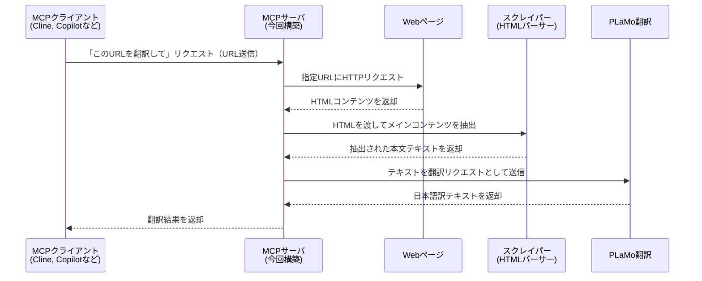

# PLaMo翻訳 + WebスクレイピングによるローカルMCPサーバの設計ドキュメント

## 目的

技術関連の英文Webページを、**文脈を考慮した高精度な日本語翻訳**で読めるようにする。

たとえば、LMクライアントから「以下のURLを日本語に訳して: {URL}」のように入力するだけで、自然で高品質な翻訳が返ってくるユーザー体験を実現する。

---

## 🔍 背景

生成AI（LLM）が私たちの開発体験を劇的に変えつつある現在、技術の変化速度も加速の一途をたどっている。

こうした状況下で、**日々最新の情報をキャッチアップし、自身の開発に素早く取り入れる力**がエンジニアとして生き残るために極めて重要になっている。

しかし、技術情報の一次ソースは多くが英語で提供されており、その読み解きには時間や労力がかかる。AI時代とはいえ、**「英文を素早くかつ正確に理解する」ことは依然として課題である**。

---

## ハイレベルアーキテクチャ

---

## MCPサーバの概要

MCPサーバは、**指定された英文WebページのURLから主要テキストを抽出し、日本語訳を返すローカルサービス**である。

- URLから対象Webページを取得
- ページ内のメインコンテンツをスクレイピングで抽出
- 抽出した英文テキストを高精度な翻訳モデル（PLaMo）で日本語に変換
- 翻訳結果をMCPクライアントに返却

---

## MCPサーバの内部仕様

### 1. LMクライアントとの連携

- MCPのToolメソッドで翻訳サービスを呼び出せるように実装する。
- LMクライアントから利用可能なように、[Model Context Protocol (MCP) Python SDK](https://github.com/modelcontextprotocol/python-sdk) を使用。

---

### 2. クローリングおよびスクレイピング処理

- Webページからメインコンテンツ（本文）を抽出するために、[**Trafilatura**](https://github.com/adbar/trafilatura) を使用。
  - 特徴：URLを渡すだけで主要テキスト部分を自動抽出できる高精度なライブラリ。

---

### 3. 日本語翻訳処理

- 翻訳には [**plamo-2-translate**](https://huggingface.co/pfnet/plamo-2-translate) モデルを使用。
- モデルはローカルで [`vLLM`](https://docs.vllm.ai/en/latest/) を用いて実行する。

#### 長文翻訳への対応

翻訳品質を保ちつつ、モデルのコンテキスト長（`max_model_len`）やメモリ制限を考慮するため、**スライディングウィンドウ方式**によって入力を分割し、文脈を保持しながら翻訳を行う。

- 入力ファイルを**行単位で分割**
- 一度に翻訳する範囲として**複数行をまとめて渡す**
- 前回の翻訳範囲と**数行重なるようにスライド**させることで、文脈の継続性を確保
- この方法により、全文を一括処理せずに自然な翻訳を段階的に生成可能

> 参考: [ファイル全体を翻訳するための分割手法（Zenn記事）](https://zenn.dev/zaburo_ch/articles/e6a3b45b3bfcdc#ファイル全体を翻訳する)
